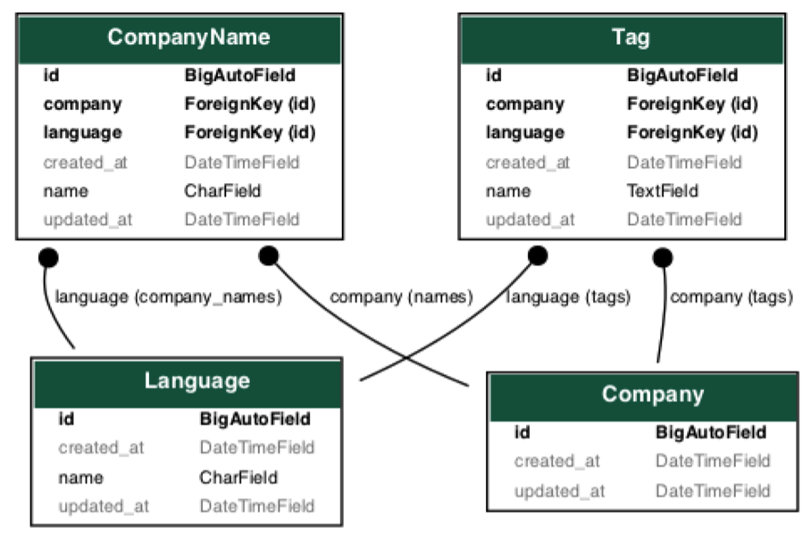

# 원티드x위코드 백엔드 프리온보딩 프로젝트 #3

- 관련 기업 정보
  - 기업명 : 원티드랩

## 역할
|이름   |github                   |담당 기능|
|-------|-------------------------|------------------|
|박세원 |[sw-develop](https://github.com/sw-develop)   |회사 추가 API 구현, Docker/Nginx/Uvicorn을 사용해 AWS EC2로 배포|


## 구현 조건 내용
<details>
<summary><b>구현 조건 내용 보기</b></summary>
<div markdown="1">
  
### **[필수 포함 사항]**

- READ.ME 작성
    - 프로젝트 빌드, 자세한 실행 방법 명시
    - 구현 방법과 이유에 대한 간략한 설명
    - 완료된 시스템이 배포된 서버의 주소
    - Swagger나 Postman을 통한 API 테스트할때 필요한 상세 방법
    - 해당 과제를 진행하면서 회고 내용 블로그 포스팅
- Swagger나 Postman을 이용하여 API 테스트 가능하도록 구현

## [과제  안내]

- 원티드 선호 기술스택: Python flask 또는 fastapi

<aside>
📝 다음과 같은 내용을 포함하는 테이블을 설계하고 다음과 같은 기능을 제공하는 REST API 서버를 개발해주세요.

</aside>

✔️ **데이터**

---

- 회사 정보
    - 회사 이름 (다국어 지원 가능)
- 회사 정보 예제
    - 회사 이름 (원티드랩 / Wantedlab)
- 데이터 셋은 원티드에서 제공
    
    [wanted_temp_data.csv](https://s3-us-west-2.amazonaws.com/secure.notion-static.com/81f13ae2-fabc-4fad-a754-9b2d684f41a8/wanted_temp_data.csv)
    
- 데이터셋 예제
    - 원티드랩 회사는 한국어, 영어 회사명을 가지고 있습니다. (모든 회사가 모든 언어의 회사명을 가지고 있지는 않습니다.)


✔️ **REST API 기능**

---

- 회사명 자동완성
    - 회사명의 일부만 들어가도 검색이 되어야 합니다.
- 회사 이름으로 회사 검색
- 새로운 회사 추가

**✔️ 개발 조건**

---

- 제공되는 test case를 통과할 수 있도록 개발해야 합니다.
    
    [test_app.py](https://s3-us-west-2.amazonaws.com/secure.notion-static.com/0d2517b3-b80b-4a1b-82c4-9bc6f2a0d5ae/test_app.py)
    
- ORM 사용해야 합니다.
- 결과는 JSON 형식이어야 합니다.
- database는 RDB를 사용해야 합니다.
- database table 갯수는 제한없습니다.
- 필요한 조건이 있다면 추가하셔도 좋습니다.
- Docker로 개발하면 가산점이 있습니다.

  
</div>
</details>

## 사용 기술 및 tools
> - Back-End :  FastAPI, sqlite, swagger, pydantic
> - Deploy : Docker, Docker Compose, AWS EC2
> - ETC :  git, github

## 모델링


## API
- GET /search/   
- GET /companies/{company_name}/   
- POST /companies/
  - 회사를 추가할 때, ko, en, ja 말고도 타 언어의 회사이름과 태그를 추가할 수 있습니다.
  
    
## 배포정보
|구분   |  정보          |비고|
|-------|----------------|----|
|배포플랫폼 | AWS EC2    |    |
|API 주소 | http://ec2-3-37-125-5.ap-northeast-2.compute.amazonaws.com/            |    |


## API TEST 방법
- swagger docs -> [링크](http://ec2-3-37-125-5.ap-northeast-2.compute.amazonaws.com/docs)


## 설치 및 실행 방법
###  Local 개발 및 테스트용

1. 해당프로젝트를 clone 하고, 프로젝트 폴더로 들어간다.
    ```bash
    $ git clone https://github.com/Wanted-Preonboarding-Backend-1st-G5/Assignment3_SH_SW
    $ cd Assignment3_SH_SW
    
    ```
2. 가상 환경을 만들고 프로젝트에 사용한 python package를 받는다.
    ```bash
    $ python3 -m venv .venv
    $ source .venv/bin/activate
    $ pip install -r requirements.txt
    ```

3. 서버를 실행시켜 내장db, sqlite를 생성한다.
      ```bash
      $ uvicorn app:app --reload
      ```

4. 파이썬 쉘을 켜서 제공된 데이터를 import 한다.
    ```bash
    $ python3
    >>> from data_import import *
    >>> import_data('wanted_temp_data.csv')
    >>> exit()
    ```
    
5. 제공된 테스트 코드를 실행한다.
    ```bash
    $ pytest ./test_app.py
    ```

# Reference
이 프로젝트는 원티드x위코드 백엔드 프리온보딩 과제 일환으로 원티드랩에서 출제한 과제를 기반으로 만들었습니다.
